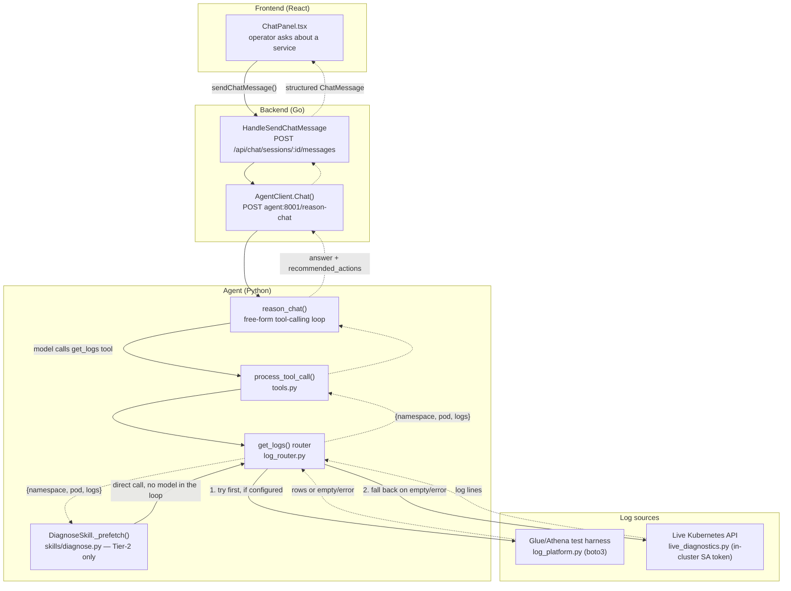
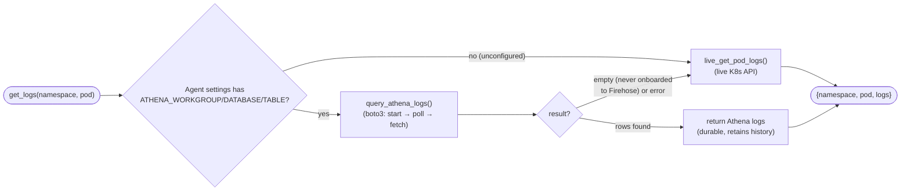
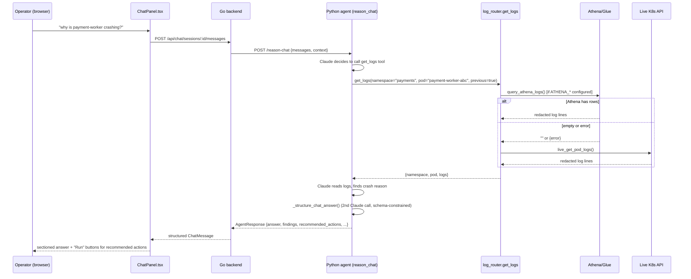

# Log source routing: frontend → backend → agent → Athena/cluster

How a question about a service turns into the right log source being read,
with no manual configuration (ADR 0021 / P15 connector, phase 1). Covers both
paths that fetch logs: the free-form **Chat** path and the deterministic
**Diagnose** (Tier-2) path.

## Component interaction

## Where "discovery" actually happens

There is no registry to look up and no per-namespace flag to set. Discovery
is a runtime decision made once, inside `log_router.get_logs()`, every time
logs are requested:

Same function, same output shape, either caller:

- **Chat path** — `get_logs` is a Claude-callable tool. The model just asks
  for logs; which backend answered is invisible to it (`tools.py`
  registers/dispatches it, `prompts.py` tells Claude to prefer it over
  `get_pod_logs`/`live_get_pod_logs`).
- **Diagnose path** — `DiagnoseSkill._prefetch()` (Pattern A: parallel
  `asyncio.gather` pre-fetch, then exactly one Opus call with no `tools=`
  passed) calls `get_logs()` directly as plain Python, for every pod that
  looks like it's crashing.
- **Incident-response path** — `IncidentResponderSkill._prefetch()` (same
  Pattern A shape, spec 011 Use Case 1) also calls `get_logs()` directly when
  building a remediation proposal.

## End-to-end data flow (chat path, sequence)

## Key files

| Layer | File | Role |
|---|---|---|
| Frontend | `src/frontend/src/components/ChatPanel.tsx` | operator's chat UI |
| Frontend | `src/frontend/src/api.ts` | `sendChatMessage()` |
| Backend | `src/backend/internal/api/handlers.go` | `HandleSendChatMessage` |
| Backend | `src/backend/internal/api/agent_client.go` | `AgentClient.Chat()` → `POST /reason-chat` |
| Agent | `src/agent/k8fy/agent.py` | `reason_chat()` — free-form tool loop |
| Agent | `src/agent/k8fy/skills/diagnose.py` | `DiagnoseSkill._prefetch()` — Tier-2 deterministic prefetch |
| Agent | `src/agent/k8fy/tools.py` | `get_logs` tool registration + dispatch |
| Agent | `src/agent/k8fy/log_router.py` | **the routing decision** — Athena first, cluster fallback |
| Agent | `src/agent/k8fy/log_platform.py` | Athena/Glue query (boto3) |
| Agent | `src/agent/k8fy/live_diagnostics.py` | live K8s API query |
| Agent | `src/agent/k8fy/log_redaction.py` | shared secret-scrubbing, used by both sources |
| Agent | `src/agent/config/settings.py` | `ATHENA_WORKGROUP/DATABASE/TABLE` |
| Infra | `infra/kubernetes/agent.yaml` | Athena connection env vars (agent pod only) |
| Infra | `infra/terraform/aws/logging.tf` | Fargate→Firehose→S3→Glue pipeline (ADR 0021), IRSA grants |
