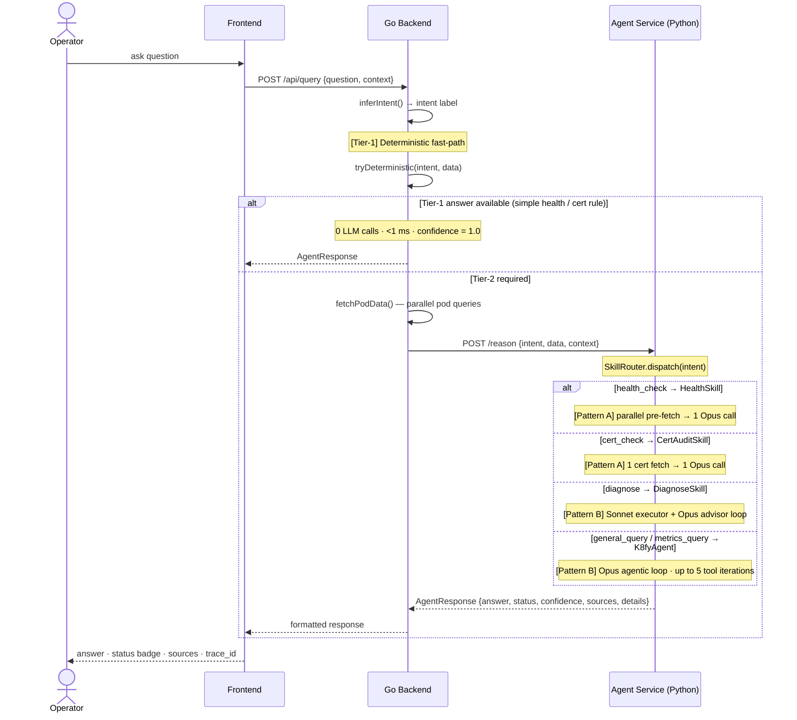
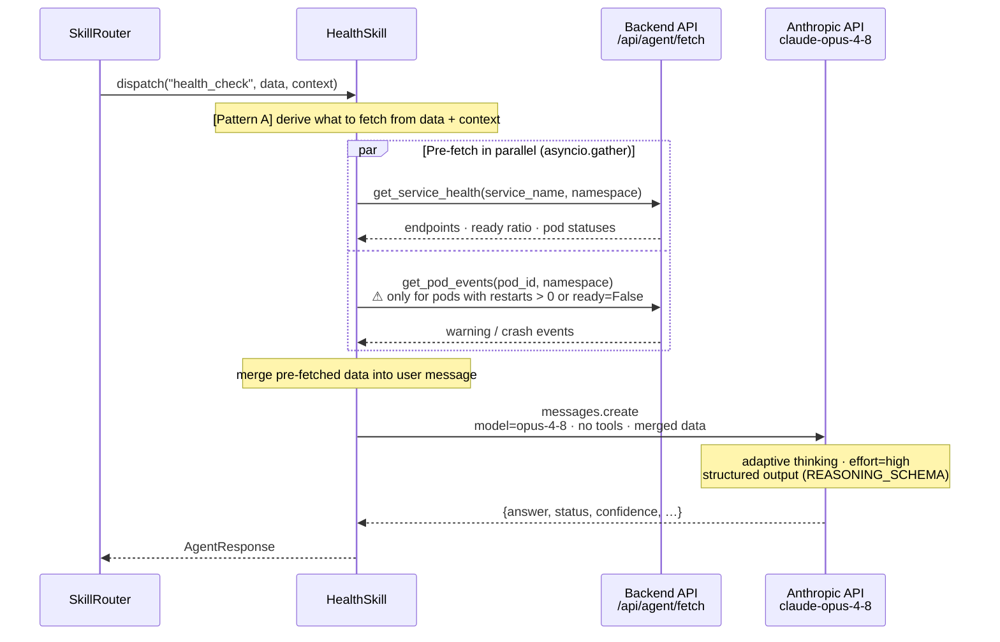
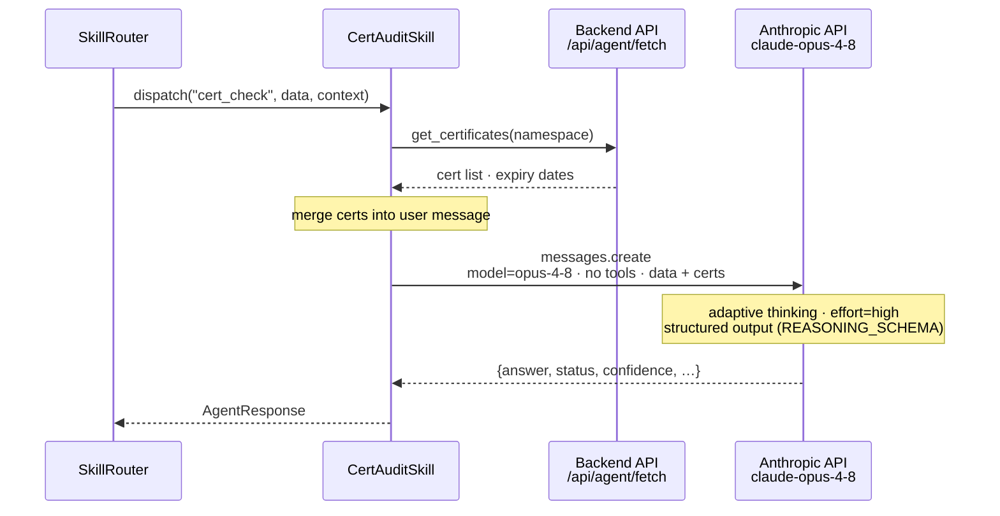
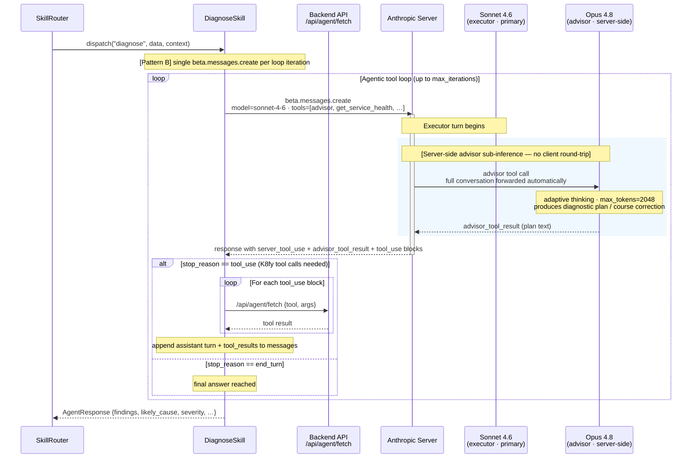
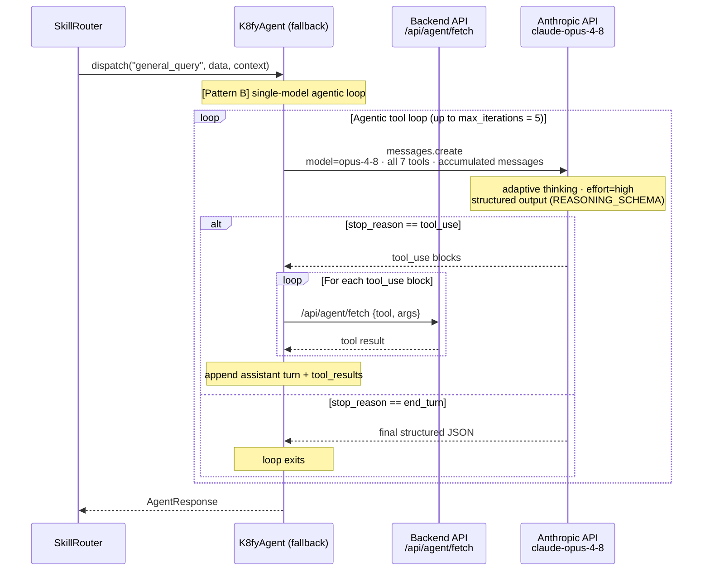

# Sequence Flows

End-to-end call sequences for every query path through the system.
Diagrams are in [Mermaid](https://mermaid.js.org) — rendered by GitHub, VS Code
(Mermaid Preview extension), and most documentation tools.

**Legend**
- **Solid arrow** (`->>`) — explicit code call / HTTP request
- **Dashed arrow** (`-->>`) — return / response
- **Dashed box** (`rect`) — server-side or parallel boundary
- `[Tier-1]` — deterministic, no LLM
- `[Tier-2]` — agentic, involves Claude
- `[Pattern A]` — parallel pre-fetch + single Claude call
- `[Pattern B]` — Claude-driven agentic tool loop

---

## 1. End-to-end overview — all paths

Shows the Tier-1 fast-path, the Tier-2 skill dispatch, and which strategy each
skill uses. Expand the per-skill diagrams below for internal detail.

---

## 2. Pattern A — HealthSkill (`health_check`)

Pre-fetches service health and degraded-pod events in parallel, then makes
exactly one Claude call. No agentic tool loop.

**Cost profile:** N parallel backend fetches (milliseconds, no billing) + **1 Opus call**.
Tool iterations recorded in Prometheus: **0**.

---

## 3. Pattern A — CertAuditSkill (`cert_check`)

The simplest Pattern A case. The cert list is the only data source and its
parameters are fully known from context — always one fetch, always one call.

**Cost profile:** 1 backend fetch + **1 Opus call**.
Tool iterations recorded in Prometheus: **0**.

---

## 4. Pattern B — DiagnoseSkill (`diagnose`) with Advisor/Executor

The executor (Sonnet 4.6) is the primary model and drives the tool loop.
The advisor (Opus 4.8) is a server-side tool the executor calls for strategic
guidance — all within a single `beta.messages.create` request per iteration.

**Cost profile:** per iteration — Sonnet tokens (executor) + Opus tokens (advisor, billed separately via `usage.iterations`).
Advisor called up to **3 times** per request (`max_uses=3`). Tool iterations recorded in Prometheus: **actual count**.

---

## 5. Pattern B — K8fyAgent fallback (`general_query`, `metrics_query`)

Single-model agentic loop. No advisor tool. Claude decides which tools to call
based on the data and question.

**Cost profile:** N Opus calls (one per loop iteration). Tool iterations recorded in Prometheus: **actual count**.

---

## Summary comparison

| Path | Skill | LLM calls | Tool loop | Models |
|------|-------|-----------|-----------|--------|
| Tier-1 | — | **0** | no | — |
| Pattern A | HealthSkill | **1** | no | Opus 4.8 |
| Pattern A | CertAuditSkill | **1** | no | Opus 4.8 |
| Pattern B | DiagnoseSkill | **1–N** (Sonnet) + advisor sub-calls (Opus) | yes | Sonnet 4.6 + Opus 4.8 |
| Pattern B | K8fyAgent | **1–N** (Opus) | yes | Opus 4.8 |
